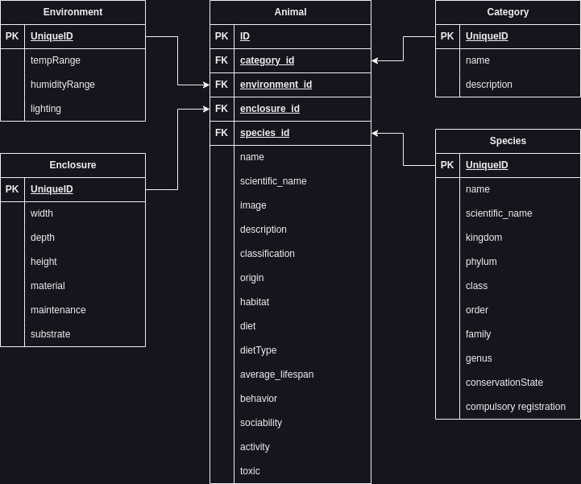

# General Documentation

## ZenBreeder

### Data Model ZenBreeder

### Class Diagram ZenBreeder

## ZenLexicon

### Data Model ZenLexicon

### Class Diagram ZenLexicon

## ZenTank

### Data Model ZenTank

### Class Diagram ZenTank

